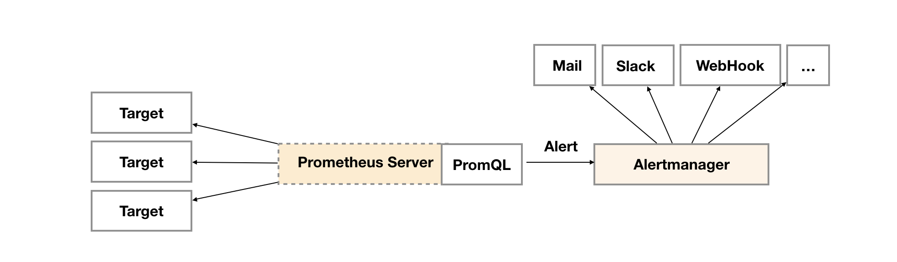

# Prometheus

## 什么是 Prometheus

Prometheus 是一个开源系统监控和警报工具。

- Prometheus 是按照 Google SRE 运维之道的理念构建的，具有实用性和前瞻性。
- Prometheus 社区非常活跃，基本稳定在 1个月1个版本的迭代速度，从 2016 年 v1.01 开始接触使用以来，到目前发布的 v1.8.2 以及最新最新的 v2.1 ，你会发现 Prometheus 一直在进步、在优化。
- Go 语言开发，性能不错，安装部署简单，多平台部署兼容性好。
- 丰富的数据收集客户端，官方提供了各种常用 exporter。
- 丰富强大的查询能力。


## Prometheus VS Zabbix 

|            | 发行时间 | 开发语言 | 性能           | 社区                     | 容器支持                                          | 部署难度                                | 配置修改   |
| ---------- | -------- | -------- | -------------- | ------------------------ | ------------------------------------------------- | --------------------------------------- | ---------- |
| Prometheus | 2016     | Go       | 支持万为单位   | 活跃                     | 支持K8s容器集群的监控，是目前容器监控最好解决方案 | 一条命令便可以启动                      | 配置文件   |
| Zabbix     | 2012     | C、PHP   | 上限约1000节点 | 目前活跃度不如Prometheus | 对容器的支持较差                                  | 服务端需要安装和配置MySQL、PHP、Apached | 图形化界面 |

## Prometheus

### Prometheus  安装
https://prometheus.io/docs/prometheus/latest/installation/

###  常用启动参数配置

| 参数                      | 作用                                                         |
| ------------------------- | ------------------------------------------------------------ |
| `--config.file`           | 指定Prometheus配置文件的路径。默认为`prometheus.yml`。       |
| `--web.listen-address`    | 指定Prometheus的监听地址和端口。默认为`0.0.0.0:9090`。       |
| `--storage.tsdb.path`     | 指定时间序列数据库（TSDB）的存储路径。默认为`data/`。        |
| `--storage.tsdb.retention.time` | 指定Prometheus存储时间序列数据的保留时间。默认值为 `15d` |
| `--storage.tsdb.retention.size` | 指定Prometheus存储时间序列数据的保留大小，如 `100GB`。默认值为 `0`。 |
| `--web.enable-lifecycle`  | 启用远程管理接口，允许通过HTTP接口进行配置和管理。默认为`false`。 |
| `--web.enable-admin-api`  | 启用管理员API，允许通过HTTP接口进行访问。默认为`false`。     |
| `--web.console.libraries` | 指定Prometheus控制台的库文件路径。默认为`consoles/`。        |
| `--web.console.templates` | 指定Prometheus控制台的模板文件路径。默认为`console_templates/`。 |
| `--web.page-title`        | 指定Prometheus控制台的页面标题。默认为`Prometheus Time Series Collection and Processing Server`。 |

### Prometheus 配置

```yaml
# my global config
global:
  scrape_interval: 15s # Set the scrape interval to every 15 seconds. Default is every 1 minute.
  evaluation_interval: 15s # Evaluate rules every 15 seconds. The default is every 1 minute.
  # scrape_timeout is set to the global default (10s).

# Alertmanager configuration
alerting:
  alertmanagers:
    - static_configs:
        - targets:
          # - alertmanager:9093

# Load rules once and periodically evaluate them according to the global 'evaluation_interval'.
rule_files:
  # - "first_rules.yml"
  # - "second_rules.yml"

# A scrape configuration containing exactly one endpoint to scrape:
# Here it's Prometheus itself.
scrape_configs:
  # The job name is added as a label `job=<job_name>` to any timeseries scraped from this config.
  - job_name: "prometheus"

    # metrics_path defaults to '/metrics'
    # scheme defaults to 'http'.

    static_configs:
      - targets: ["localhost:9090"]

```


### 应用接入
#### Golang


#### Python


### Exporter


### Prometheus 告警
告警在 Prometheus 的架构中被划分成两个独立的部分。如下所示，通过在 Prometheus 中定义AlertRule（告警规则），Prometheus 会周期性的对告警规则进行计算，如果满足告警触发条件就会向 Alertmanager 发送告警信息。



#### 部署 Alertmanager

https://prometheus.io/download/

#### 关联 Prometheus 与 Alertmanager
在Prometheus的架构中被划分成两个独立的部分。Prometheus负责产生告警，而Alertmanager负责告警产生后的后续处理。因此Alertmanager部署完成后，需要在Prometheus中设置Alertmanager相关的信息。

编辑 Prometheus 配置文件 prometheus.yml，并添加以下内容

```yaml
alerting:
  alertmanagers:
    - static_configs:
        - targets: ['localhost:9093']
```

#### 接收告警信息

支持邮件、企业微信、Telegram、Discord、钉钉等

https://prometheus.io/docs/alerting/latest/configuration/#wechat_config


### Prometheus 定义告警规则

一条典型的告警规则如下所示：

```yaml
groups:
- name: example
  rules:
  - alert: HighErrorRate  # 告警规则的名称。
    expr: job:request_latency_seconds:mean5m{job="myjob"} > 0.5 # 基于PromQL表达式告警触发条件，用于计算是否有时间序列满足该条件。
    for: 10m # 评估等待时间，可选参数。用于表示只有当触发条件持续一段时间后才发送告警。在等待期间新产生告警的状态为pending。
    labels: # 自定义标签，允许用户指定要附加到告警上的一组附加标签。
      severity: page
    annotations:  # 用于指定一组附加信息，比如用于描述告警详细信息的文字等，annotations的内容在告警产生时会一同作为参数发送到Alertmanager。
      summary: High request latency
      description: description info
```


修改Prometheus配置文件prometheus.yml,添加以下配置：

```yaml
rule_files:
  - rules/*.rules
```

创建告警文件hoststats-alert.rules内容如下：

```yaml
groups:
- name: hostStatsAlert
  rules:
  - alert: hostCpuUsageAlert
    expr: sum(avg without (cpu)(irate(node_cpu{mode!='idle'}[5m]))) by (instance) > 0.85
    for: 1m
    labels:
      severity: page
    annotations:
      summary: "Instance {{ $labels.instance }} CPU usgae high"
      description: "{{ $labels.instance }} CPU usage above 85% (current value: {{ $value }})"
```


| 服务          | 地址                           |
| ------------- | ------------------------------ |
| alertmanager  | http://localhost:9093/#/alerts |
| prometheus    | http://localhost:9090/graph    |
| node_exporter | http://localhost:9100/metrics  |


## 相关链接

- [Prometheus 官方网站](https://prometheus.io/)
- [Prometheus GitHub 仓库](https://github.com/prometheus/prometheus)
- [Grafana 官方网站](https://grafana.com/)
- [Prometheus Exporter 列表](https://prometheus.io/docs/instrumenting/exporters/)
