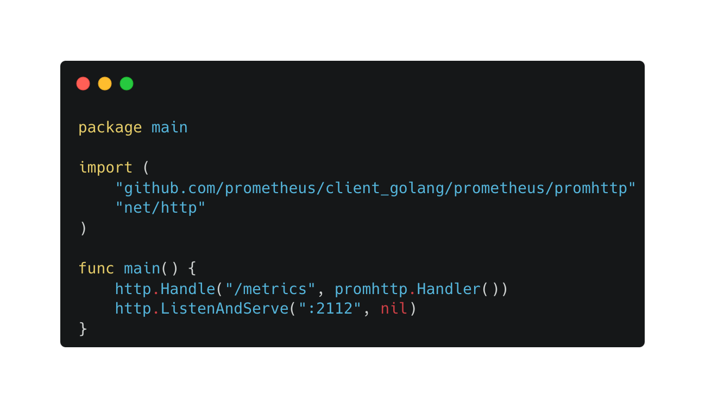

# Prometheus

## 什么是 Prometheus

Prometheus 是一个开源系统监控和警报工具。

- Prometheus 是按照 Google SRE 运维之道的理念构建的，具有实用性和前瞻性。
- Prometheus 社区非常活跃，基本稳定在 1个月1个版本的迭代速度，从 2016 年 v1.01 开始接触使用以来，到目前发布的 v1.8.2 以及最新最新的 v2.1 ，你会发现 Prometheus 一直在进步、在优化。
- Go 语言开发，性能不错，安装部署简单，多平台部署兼容性好。
- 丰富的数据收集客户端，官方提供了各种常用 exporter。
- 丰富强大的查询能力。


## Prometheus VS Zabbix 

|            | 发行时间 | 开发语言 | 性能           | 社区                     | 容器支持                                          | 部署难度                                | 配置修改   |
| ---------- | -------- | -------- | -------------- | ------------------------ | ------------------------------------------------- | --------------------------------------- | ---------- |
| Prometheus | 2016     | Go       | 支持万为单位   | 活跃                     | 支持K8s容器集群的监控，是目前容器监控最好解决方案 | 一条命令便可以启动                      | 配置文件   |
| Zabbix     | 2012     | C、PHP   | 上限约1000节点 | 目前活跃度不如Prometheus | 对容器的支持较差                                  | 服务端需要安装和配置MySQL、PHP、Apached | 图形化界面 |

## Prometheus

### Prometheus  安装
https://prometheus.io/docs/prometheus/latest/installation/

###  常用启动参数配置

| 参数                      | 作用                                                         |
| ------------------------- | ------------------------------------------------------------ |
| `--config.file`           | 指定Prometheus配置文件的路径。默认为`prometheus.yml`。       |
| `--web.listen-address`    | 指定Prometheus的监听地址和端口。默认为`0.0.0.0:9090`。       |
| `--storage.tsdb.path`     | 指定时间序列数据库（TSDB）的存储路径。默认为`data/`。        |
| `--storage.tsdb.retention.time` | 指定Prometheus存储时间序列数据的保留时间。默认值为 `15d` |
| `--storage.tsdb.retention.size` | 指定Prometheus存储时间序列数据的保留大小，如 `100GB`。默认值为 `0`。 |
| `--web.enable-lifecycle`  | 启用远程管理接口，允许通过HTTP接口进行配置和管理。默认为`false`。 |
| `--web.enable-admin-api`  | 启用管理员API，允许通过HTTP接口进行访问。默认为`false`。     |
| `--web.console.libraries` | 指定Prometheus控制台的库文件路径。默认为`consoles/`。        |
| `--web.console.templates` | 指定Prometheus控制台的模板文件路径。默认为`console_templates/`。 |
| `--web.page-title`        | 指定Prometheus控制台的页面标题。默认为`Prometheus Time Series Collection and Processing Server`。 |

### Prometheus 配置

```yaml
# my global config
global:
  scrape_interval: 15s # Set the scrape interval to every 15 seconds. Default is every 1 minute.
  evaluation_interval: 15s # Evaluate rules every 15 seconds. The default is every 1 minute.
  # scrape_timeout is set to the global default (10s).

# Alertmanager configuration
alerting:
  alertmanagers:
    - static_configs:
        - targets:
          # - alertmanager:9093

# Load rules once and periodically evaluate them according to the global 'evaluation_interval'.
rule_files:
  # - "first_rules.yml"
  # - "second_rules.yml"

# A scrape configuration containing exactly one endpoint to scrape:
# Here it's Prometheus itself.
scrape_configs:
  # The job name is added as a label `job=<job_name>` to any timeseries scraped from this config.
  - job_name: "prometheus"

    # metrics_path defaults to '/metrics'
    # scheme defaults to 'http'.

    static_configs:
      - targets: ["localhost:9090"]

```


### 应用接入
#### Golang



#### Python


### Exporter


### Prometheus 告警


### Prometheus 的核心概念

- 多维数据模型
- 时间序列
- 标签和标签匹配
- Exporter 和数据采集

### 3. 数据采集和监控

- 使用 Exporter 收集数据
- 内置 Exporter 和社区 Exporter
- 自定义监控指标
- 示例：监控一个应用程序

### 4. Prometheus 查询语言（PromQL）

- 基本查询
- 聚合操作
- 图表和可视化
- 实际查询示例

### 5. 数据存储和持久性

- 内置时间序列数据库
- 压缩和数据保留策略
- 高可用性存储
- 数据备份和恢复

### 6. 警报和通知

- Prometheus 警报规则
- 集成告警通知方式
- 实际警报设置

### 7. 实际应用场景

- 容器化环境下的 Prometheus
- 云原生应用程序监控
- 微服务架构的监控
- 最佳实践和案例研究


## 相关链接

- [Prometheus 官方网站](https://prometheus.io/)
- [Prometheus GitHub 仓库](https://github.com/prometheus/prometheus)
- [Grafana 官方网站](https://grafana.com/)
- [Prometheus Exporter 列表](https://prometheus.io/docs/instrumenting/exporters/)
